# Assignment 1 of PRML

## Introduction

In this assignment, four requirements are listed below:

- What will happen when we varies the number of data used?
- How the number of bins of Histogram affects the estimation?
- Try different *h* for Kernel Density Estimate (KDE)
- Vary *K* in Nearest Neighbor Method (k-NN) 

  And they will be solved case by case. But before that, I will give a brief *summery* of the details I will discuss in this paper. And after that, fake codes for the Kernel Density Estimate and k-NN will be presented. (As the function of Histogram Method is provided by `matplotlib`, I will not show it here.)

**Method Used**: Histogram Method, Kernel Density Estimate and the k-Nearest Neighbor Method

**Goal**: Estimate the distribution of a given dataset. And try to figure out how the parameters of these methods affects the result.

- Requirement One
  - How the number of samples affects the result?
  - Using suggested numbers for testing the three methods.
  - Find some more details in #TODO
- Requirement Two
  - Consider Histogram Method
  - Figure out how the number of bins affects the result
  - How to pick out the best choice for the number?
- Requirement Three
  - Figure out how the volume of the box affects the result
  - And how to choose a better *h* for estimation
  - Using a dataset of 100 samples. Try to get a best figure by choosing a suitable *h*
- Requirement Four
  - Plot an illustration
  - Appearance of platforms and disappearance of peaks
  - Show the method isn't always valid
    - Empirical way
    - Theoretical way

**Note**: Although the formulars used to compute the probability will be showed, the deduction will be left out.

## Formulars and Fake Code

### Kernel Density Estimate

$$ p(x)=\frac{1}{N}*\sum_{n=1}^{N}\frac{1}{(2\pi h^2)^{1/2}}exp\{ -\frac{||x-x_n||^2}{2h^2}\} $$

```
def KernelGaussian(target,dataset,paras): 
# target is the point we're computing the probability
# dataset is the sample data provided
# paras include the all the parameters of the methods
	SET sum 0
	FOR EACH data IN dataset:
		ADD result TO sum 
		#result is the computing result of the data according to the Gaussian Func
	ALTER sum ACCORDING TO paras

def Kernel(N,num):
	GENERATE sample_data ACCORDING TO N
	GENERATE test_points ACCORDING TO num
	FOR EACH test_point:
		GET the output of the point BY KernelGaussian
	PLOT
```

### Nearest Neighbor Method

$$ p(x)=\frac{K}{NV} ​$$

```
def KNN_Pro(target,dataset,N):
#dataset here is ordered by ascending
	SET flag_data TO the first data no less than target
	SET ct 0 #ct marks the number of points met
	SET flag_l TO data before flag_data
	SET flag_r TO flag_data
	WHILE ct < K:
		FIND the closer point
		ALTER flag ACCORDINGLY
	SET V TO flag_r-flag_l
	COMPUTE BY FORMULAR WITH K, V, N

def KNN(N,num,K):
GENERATE sample_data ACCORDING TO N
	GENERATE test_points ACCORDING TO num
	FOR EACH test_point:
		GET the output of the point BY KNN_Pro
	PLOT
```


## Requirement One

For convenience, parameters here are set to be the same except for number of data. And detailed settings are listed below:

| parameters | nums |
| ---------- | ---- |
| *h* (Ker) | 0.08 |
| *K* (k-NN) | 20 |
| *num* (Ker,k-NN) | 1000 |
|*bins* (Hist)|50|

And we use 100, 500, 1000, 10000 as suggested to start our explorations, but I will not present all the result here. Instead, I will show some interesting comparisons, and all the other results will be collected in the attachment.

**Overview of the three**

The change of numbers of the data has different degrees of influences on these three methods, as least under the parameters listed above. Roughly speaking, all these methods increase the similarity of the estimation, though the change on Histogram is not that obvious in larger number tests. 

---

**Histogram Method.** So we'd look at the first two pictures produced by it. *Figure 1(With N as 100) & Figure 2(With N as 500)*. 

<div align="center" >
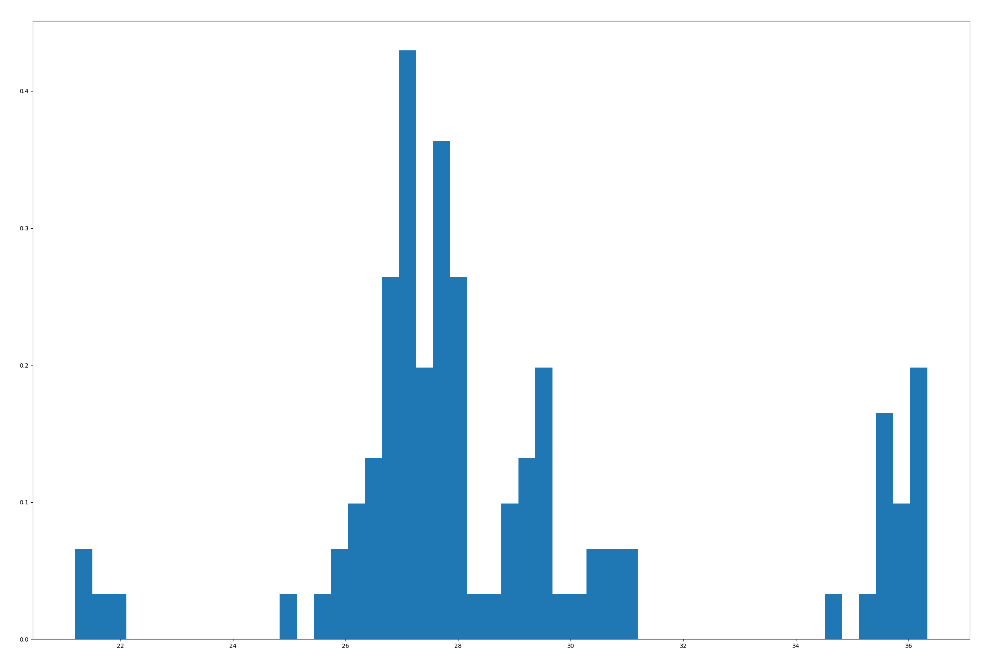
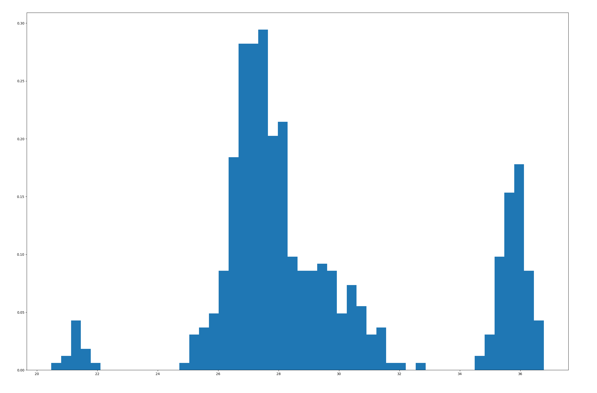
</div>

<div align="center">
    Figure 1, 2
</div>


It's obvious that the vacant bin in Figure 2 is much less than that in the Figure 1. Besides, it shows more regular shapes instead of numbers of spikes in Figure 1. It would be clear that how the number of data affects Histogram Method. To begin with, the increase of numbers decreases the number of vacant bins, since more points raise the probability for a bin to have at least one points naturally. And a larger number of data improves the situation that a position with high probability gets few samples in the test.

---

**Kernel Density Estimate.** This seems much interesting than the Histogram Method. In this test, I happen to choose 0.8 as the every beginning test, where every curve of the test (100, 500, 1000, 10000 samples) looks actually the same and smooth *See Figure 3(100)and 4(10000)*. So in order to get the influence of the test number, we consider the *h* to be 0.08 or less. After that, we get clear different figures. *The variation of h will be discussed in Requirement Three.* 

<div align="center" >

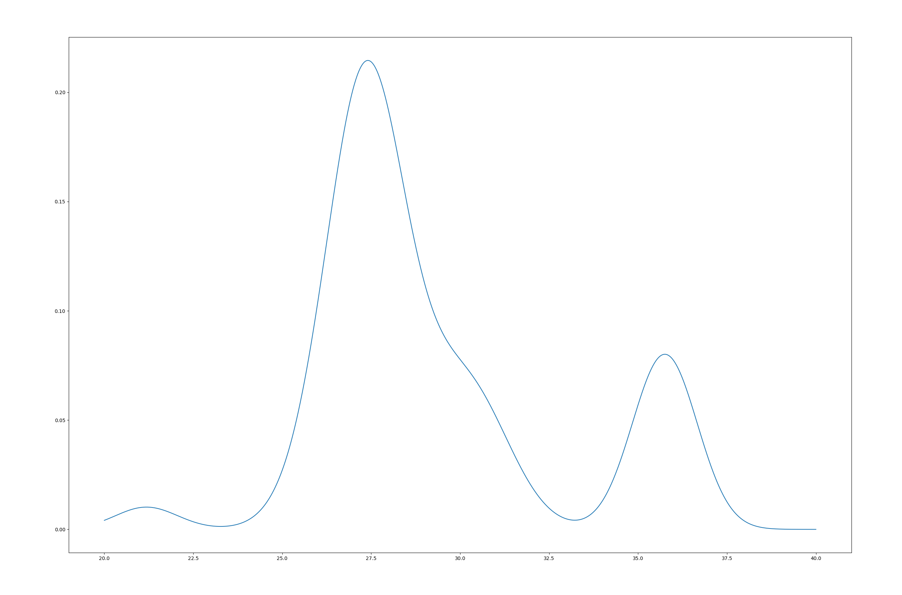
</div>
<div align="center">
    Figure 3, 4(h=0.8)
</div>

<div align="center" >
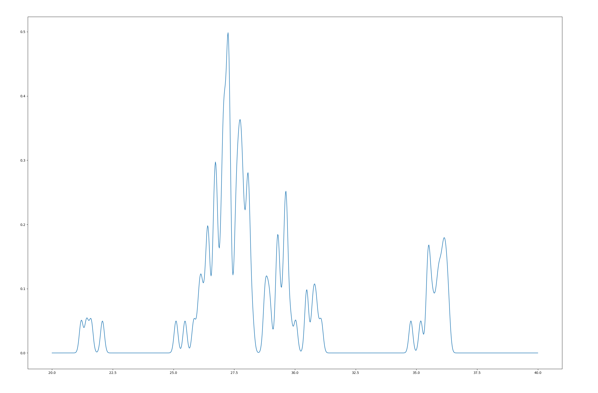
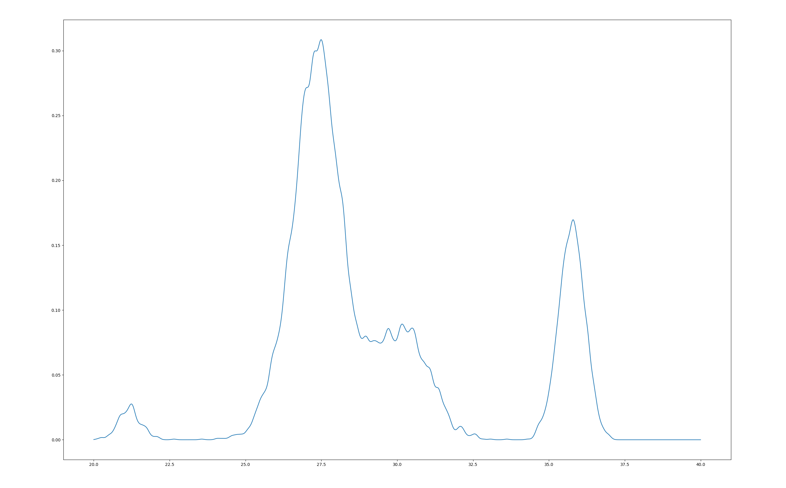
</div>
<div align="center">
    Figure 5, 6(h=0.08)
</div>

Clearly, the increase of data smooths the curve. Estimation value will not have a sudden raise in 10000 dataset as a 100 one. And with *h* to be 0.01, the difference is more recognizable. The difference in number of data just have the same function in the Histogram Method, and there is nothing more to discuss here.

---

**k-Nearest Neighbor Method.** This shows great differences comparing to the others. The change of number of data changes the shape of the curve rather than its smoothness. 

<div align="center" >
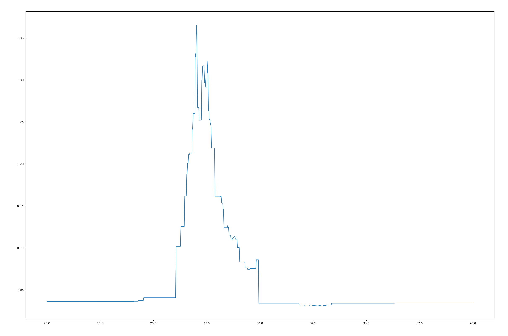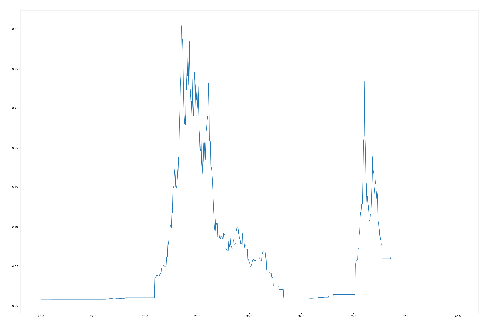

</div>

<div align="center">
    Figure 7
</div>

The most evident differences here is that in the Figure 11, only one peak is showed, while in Figure 12 there are two. And finally, in Figure 13, three peaks are recorded. Beside that, the number of platforms decrease. As the influences is totally different, the appearance of the curves require another explanation. And it's clearly connected to the value of *K*, so a furhur discuss will be put in Requirement Four.

## Requirement Two

### Some Basic Considerations 

We consider the variance of *bins* here. First of all, the choice of the number closely depends on the number of data. Suppose we have infinite number of data, then the choice for *bins* would be the more, the better. However, as described in Requirement One, Histogram Method has the problem of vacant bins, which means the increase of bins produces more vacant bins and even declined to binary figure. It's quite harmful for estimation. **So the value of *bins* should be  proportional to the number of data.** 

### Using different bins

To check the consideration above, it's necessary to have figures vary both in *bins* and *N*. Therefore, we need mountains of figures. We will give some of the figure here and put the rest in the attachment. Figures below are in order: 50,200;50,1000;150,200;150,1000.

***bins* tested**: 50, 100, 150, 200

**N tested**: 200, 500, 1000, 5000, 10000

<div align="center" >
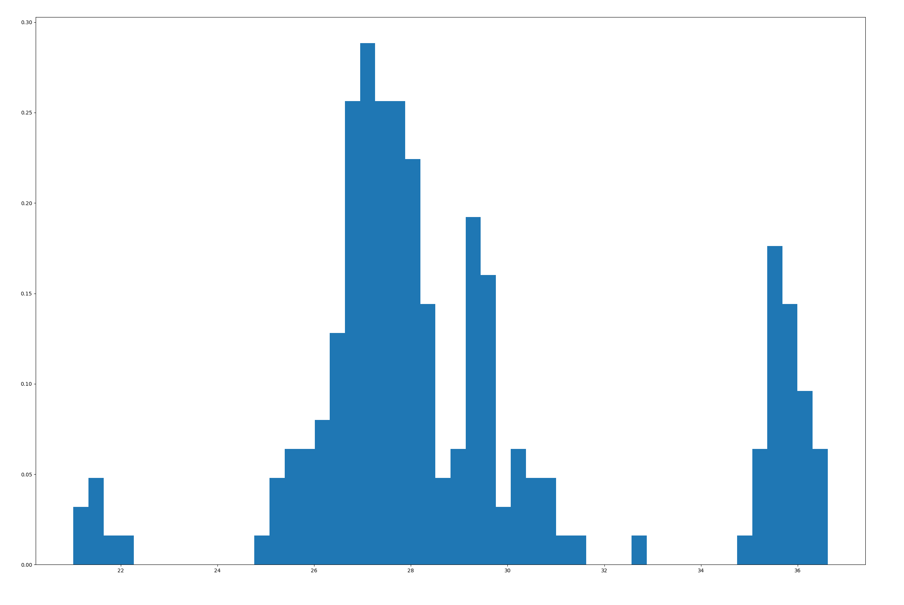
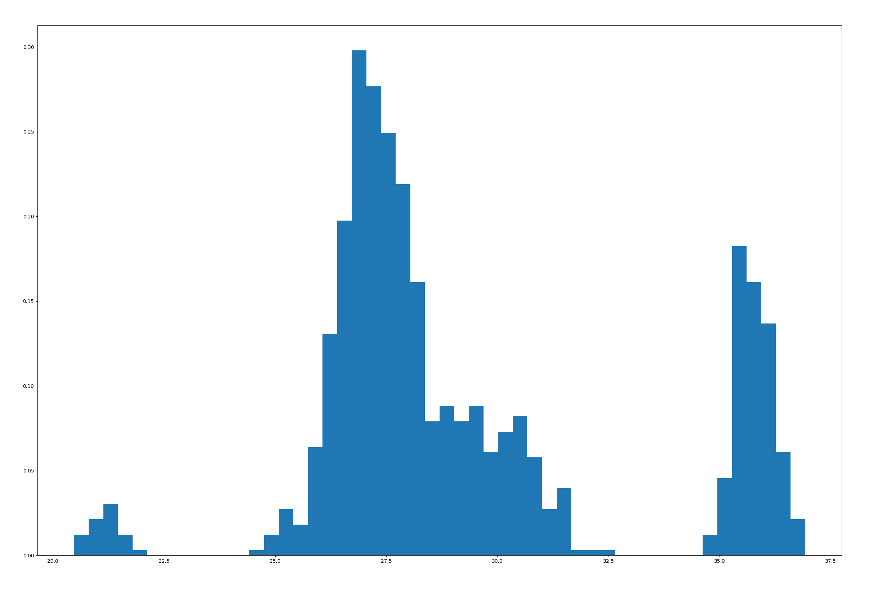
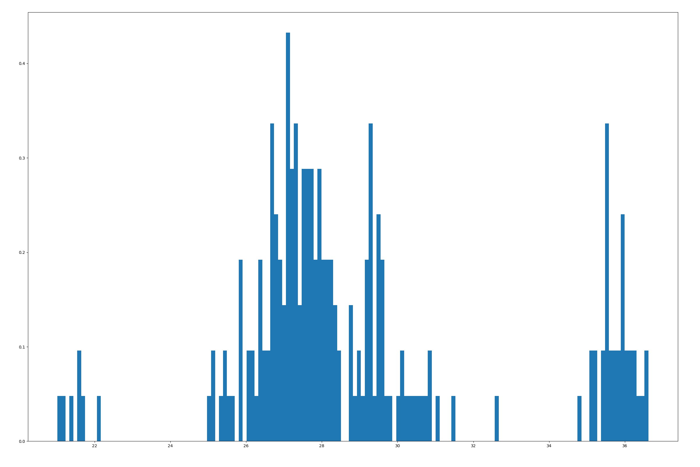
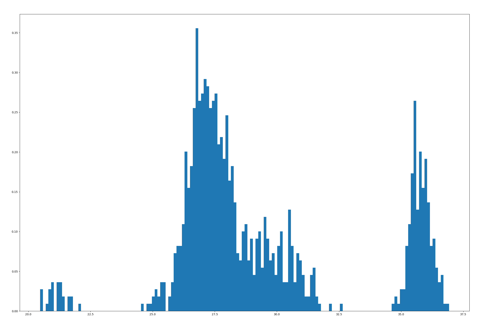
</div>
<div align="center">
    Figure 8
</div>

| Table 1 | 50   | 100  | 150  | 200  |
| ------- | ---- | ---- | ---- | ---- |
| 200     | 2    | 1    | 0    | 0    |
| 500     | 3    | 1    | 1    | 0    |
| 1000    | 3    | 2    | 2    | 1    |
| 5000    | 4    | 4    | 3    | 3    |
| 10000   | 5    | 5    | 4    | 4    |

The table above describes judges the quality of the figure output with 0 represents poor and 5 represents nice. For better comprehension, I fix *N* as 200 and find a nice number of *bins*. *Figure 9* below are in order: 5, 15, 40, 80.

<div align="center" >
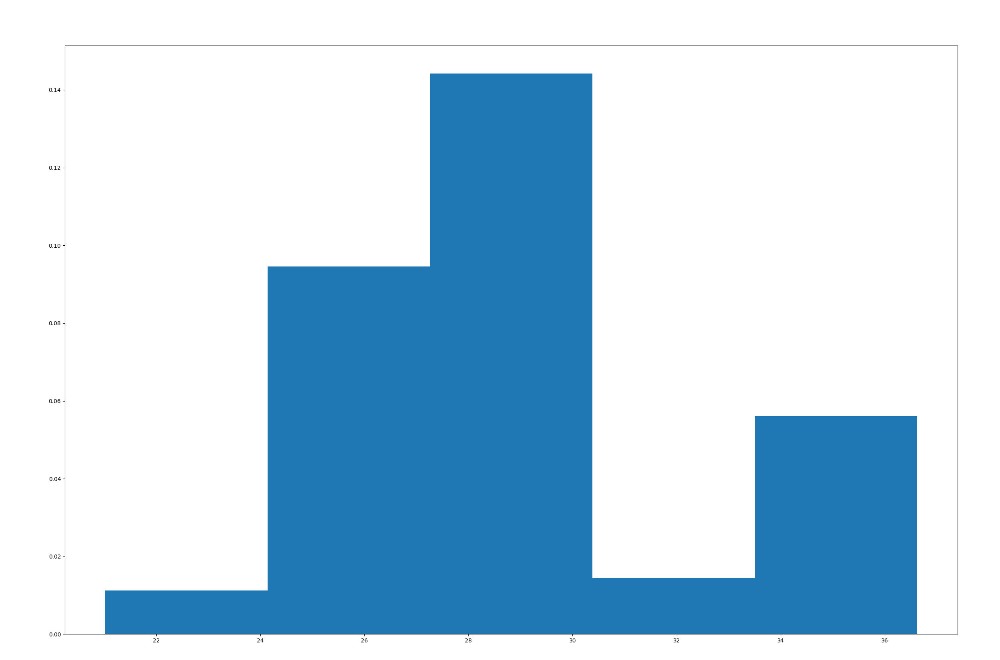
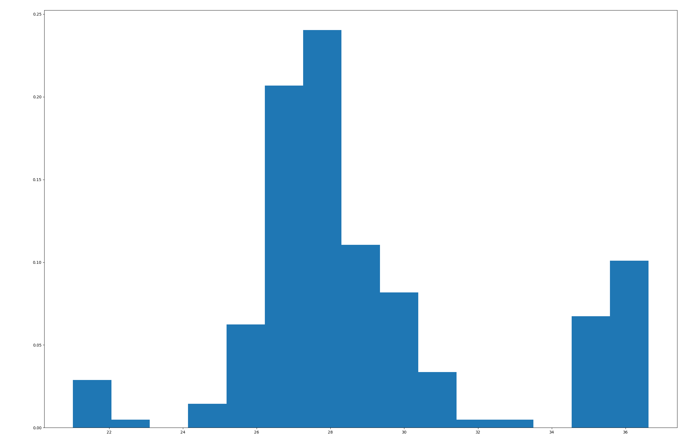

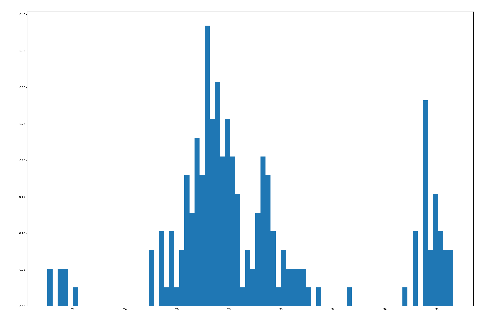
</div>
<div align="center">
    Figure 9
</div>

| Table 2 | 5    | 10   | 15   | 20   | 40   | 60   | 80   |
| ------- | ---- | ---- | ---- | ---- | ---- | ---- | ---- |
| 200     | 5    | 5    | 4    | 3    | 1    | 0    | 0    |

But remember here the score only represents the smoothness of the figures but not the actual qualities of them. By Table 1 and Table 2, we can find that as *bins* increase, it's harder to get a nice quality figure just as prediction. Note that, however, the score in Table 2 for *bins*=5 is very high **does not** mean the quality is good, but just smooth. And it's obvious that the figure of *bins*=5 doesn't show the actual  situation very well. It does show the rough distribution but is **inaccurate**. 
###  How It Works and How to Pick One

**So how the *bins* changes the shape and quality and how to get a nice *bins* once we get the dataset?** 

In fact, the variation of *bins* is similar to the variation of *N*, but influence the figure in opposite ways. And the reason has been mentioned in *Some Basic Considerations*, and I will keep using this explanation. Besides, a few words on why not small. It's obvious that a small *bins* cannot describe the change of data. In other words, it's **over-smooth**.

Based on discussions above, a nice *bins* should be suitable for a special dataset. We should prevent many vacant bins and the appearance of over-smooth. And it would be hard to give an accurate estimation of a proper *bins*. But we can have some estimation from the figures and data above. From table 1, we find that when the *bins* below the 10% of the data, the smoothness doesn't change greatly, but above that the smoothness decreases. And Table 2 shows the same. So, 7.5% to 15% of the number of data is recommended.  And for 200 dataset, 15 to 30 would be nice.

### Some More Thoughts

At the beginning, we assume the width of bins to be the same, which is unnecessary. As we know *bins* should increases as the number increases, the width of the bins should also **vary according to the distribution**. Although the goal here is to estimate the distribution, some priory knowledge of the distribution should be allowed. By using it, we can have a more detailed plan for bins, thus get a more reasonable *bins*.

## Requirement Three

In this section, the influences of *h* on KDE will be discussed. **How *h* changes the result and how to pick out a proper *h*** will be the main goals. Since the validation is included when we give out the formular, we will not have more discussions on that. 

### Some Basic Considerations

When considering KDE with non-Gaussian kernel, it's easy to figure out how *h* influences the result. A larger *h* allows more data influences the estimation of a single point, causing it show more global features around the point. Therefore, a larger *h* will make it smoother. On the opposite, a smaller *h* shows more local information, and is sharper. 

The situation in the Gaussian kernel is the same. *h* in Gaussian kernel controls the weights of influences that every points put on the test point. A larger *h* makes the weights of a further data decays slower, and has a more global feature as the non-Gaussian situation. So the conclusions of non-Gaussian KDE holds in Gaussian KDE. Under this consideration, the variance may have little influence on the change of the curve's basic shape, but has great influences on the smoothness. 

### Using Different *h*

We tested different *h* and different *N*. We score the result from 0 (poor) to 5 (nice), marking the smoothness. *Figure 10* are in order: 0.1, 0.275, 0.6, 0.8

<div align="center" >
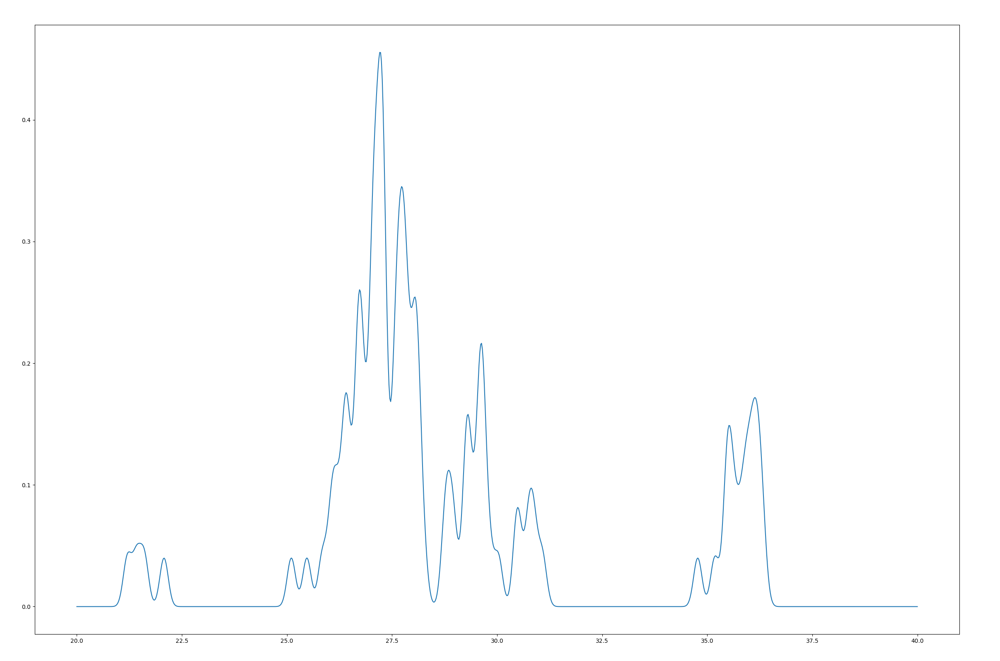
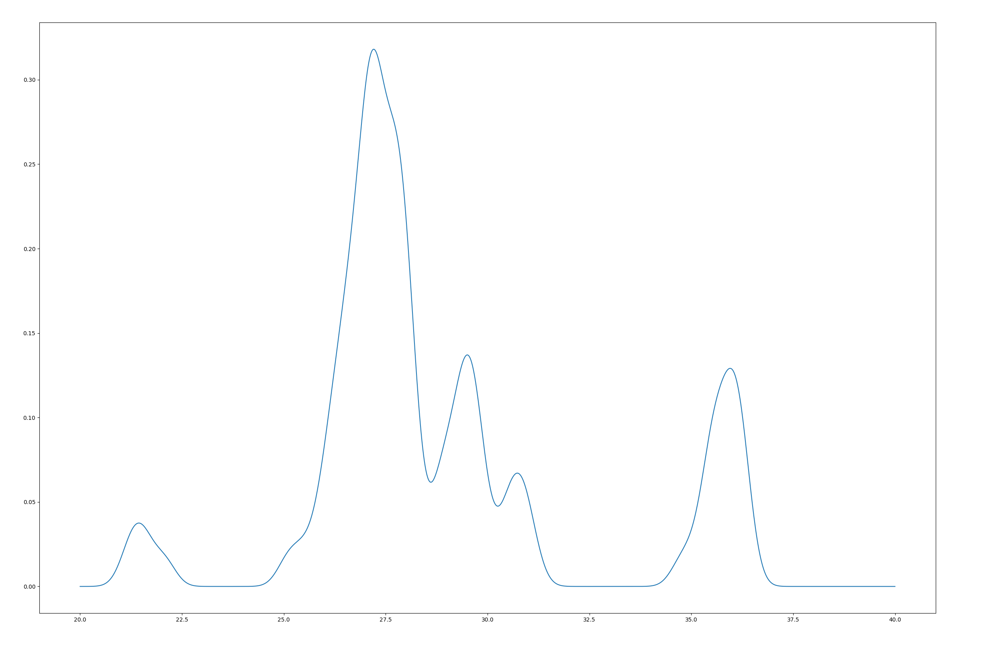

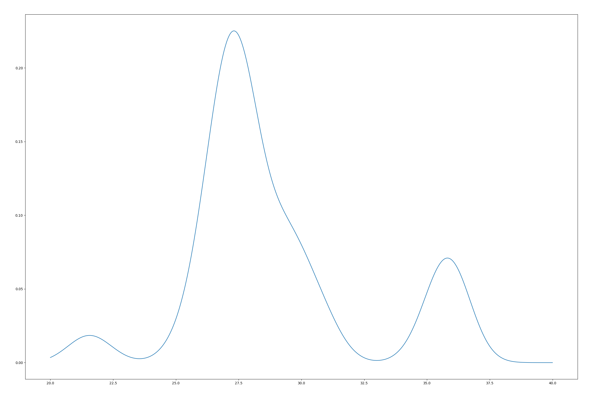
</div>
<div align="center">
    Figure 10
</div>


| Table 3 | 100  | 500  | 1000 | 10000 |
| ------- | ---- | ---- | ---- | ----- |
| 0.01    | 0    | 0    | 1    | 3     |
| 0.08    | 0    | 1    | 3    | 4     |
| 0.8     | 5    | 5    | 5    | 5     |

So basically, the result matches the prediction. And more interestingly, the smoothness can be clearly recognized as spikes. In 0.01, no mater how many data used, the spikes remain sharp. But in 0.8 situation, there is no spikes at all. For further exploration, we fix the *N* here as 100, and see what happens when we have different  *h*. 

According to Table 3, when consider *N=100*, a suitable *h* lies between 0.08 to 0.8. 

| Table 4 | 0.1  | 0.2  | 0.3  | 0.4  | 0.5  | 0.6  | 0.7|0.8  |
| ---- | ---- | ---- | ---- | ---- | ---- | ---- | ---|- |
| *h*  | 1 | 3 | 5 | 5 | 5 | 5 | 5 | 5 |

So the target lies between 0.1 to 0.3.

| Table 5 | 0.15 |0.175 |0.2 | 0.225 | 0.25 | 0.27 | 0.3  |
| -|--- | ---|- | ---- | ---- | ---- | ---- |
| *h* | 3 | 4 |4 | 4 | 4 | 4 | 5 |

In fact, *h* becomes smooth after 0.15, and after that, some peaks merge into wider peaks.

### How It Works and How to Pick One

As data and prediction matches, I will hold some of the ideas presented in *Some Basic Considerations*. The prediction only describe the reason for smoothness changes. But something interesting is that the some of the figures with small *h* has **sharp peaks**, but a bigger one doesn't. Reasons mentioned before could explain the merge of peaks in a explicit way, and from a certain aspect, they can explain the sharp peaks, too. But I'd like to give a more detailed discussion here. 

**Why sharp?** Consider a test point quite near a data, or almost the same. Then when count the sum of Gaussian kernel, the data will have heavy influences on the computing, while for another test point a little farther than the data, the influence will be much less. **Why the change of *h* solve the problem?** For a certain test point, the influences are totally decided by *h*. When *h* is small, the influences of the other data decay dramatically as the distance grows. However, when *h* is larger, the influences of farther data increase, preventing sharp changes of the value.

**So how to pick one?** As we can see from the Table above, the quality of the figure produced by KDE is grows as *h* grows and begins to drop after a certain point. But the disappearance of spikes and the merge of peaks is actually the same process, making the judge difficult. 

Recall the way we use in parametric algorithms. We introduce the methods of minimizing the bias and maximizing the likelihood. And we could have the same kind of methods here. We could use methods like mean integrated squared error or something else. We introduce  **least-squares cross-validation** [^1] here, thus to minimize:

[^1]: https://www.stat.berkeley.edu/~stark/Teach/S240/Notes/ch10.pdf,

$$ \int (\hat{f}-f)^2dx=\int\hat{f}^2dx-2\int\hat{f}fdx+\int f^2 dx $$

And by applying cross-validation, we introduce a new estimator:

$$ M_0 = \int \hat{f}^2_hdx-\frac{2}{n}\sum_i\hat{f}_{h,(i)}(X_i) $$

*X* is the observed dataset, while $\hat{f}_{h,(i)}$ means to use dataset without $X_i$. And by minimizing $M_0$, we reduce the influences of single data. As the computation would be rather complex,so I will just pick out some number to compute $M_0$. And we get the following figure:

<div align="center" >
    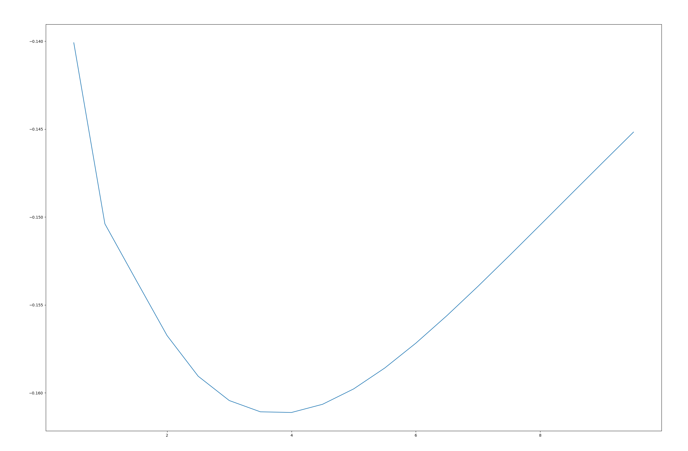</div>
<div align="center">
    Figure 11: M0's change with h
</div>

<div align="center" >
    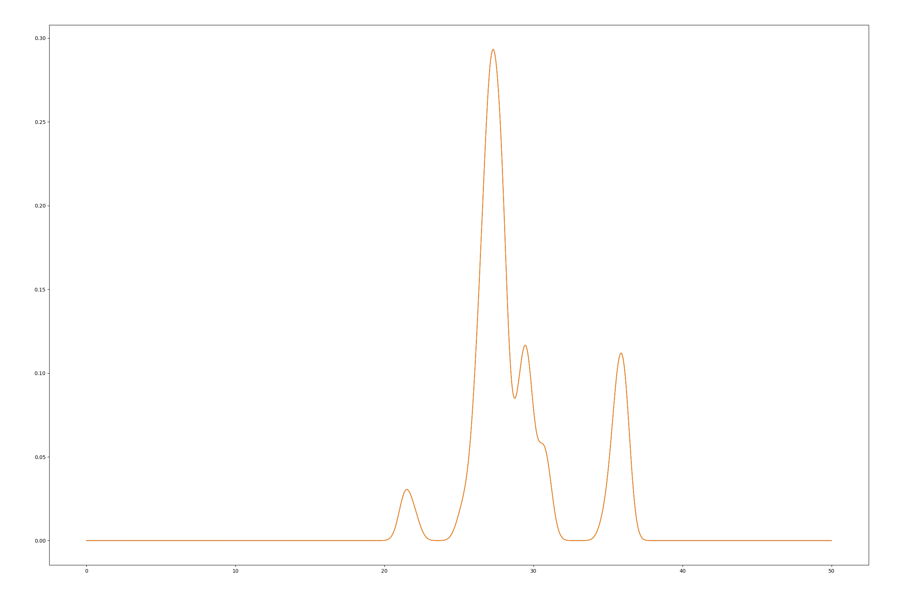</div>
<div align="center">
    Figure 12: The best figure
</div>

So we choose *h* as 0.4 to get the best estimation.

Also, besides the choice of *h*, the **choice of kernels** matters, too. Since I do not have much knowledge of the kernels other than Gaussian, I will just skip this section. But because Gaussian kernel is a normal method in most probability-relative questions, the choice will not be that bad.  

## Requirement Four

### Platforms and Disappearance of Peaks

Before changing the value of *K*, I's like to spend some time explaining the phenomenon mentioned in Requirement One.

Consider the formular of k-NN. 

$$ p(x)=\frac{K}{NV} $$

*K* is fixed here. So the change of *N* and *V* influences the estimation directly. As *N* increases, *V* is decreased. So the explanation is not that clear. We start by considering the appearance of platforms. Note that the change of *N* applies to all the test point, so that change of *V* decides the relatively probability density. We start by with K to be two for convenience. Therefore, any test point lay in two sample data has the same probability, thus a platform is produces. With the increase of sample data, the platforms become shorter and shorter. And under this consideration, the place with high probability is also placed more sample data, making it nearly impossible to produce any platform in these areas. On the other hand, region with less data is more possible to produce a longer platform, as pictured in *Figure 13-1*. Then we can consider a larger *K*. Situation will be similar. Test points lay in sparse area do not its estimation, for the number of *K* requires a large region to be included, and this will not change until a great density area appears. *Figure 13* are in order: 100, 500, 1000, 10000 number of data

<div align="center" >
    
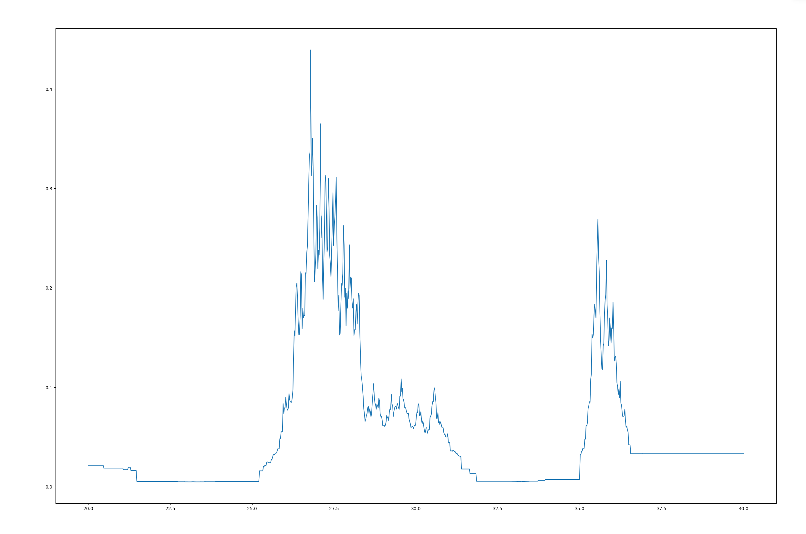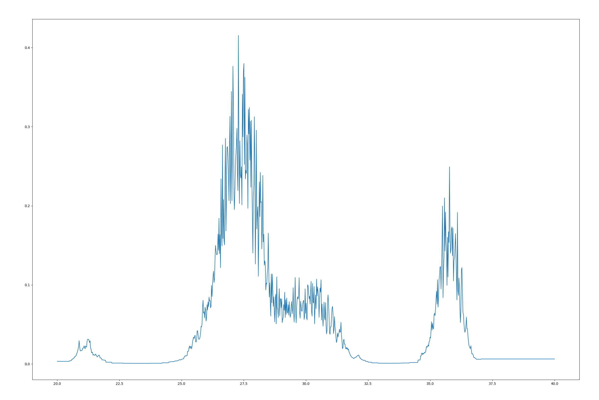</div>
<div align="center">
    Figure 13
</div>

So it's possible to explain the disappearance of the peaks.  Remember we fix our *K* to be 20, and the number of sample in *Figure 13-1* is 100. Therefore, the estimation requires more than 20 points to make a change. And now pay attention to the 30-40 region in *Figure 13-1*. In the Figures we get from Histogram Methods, we know there is a peak but it's much lower than the only peak in *Figure 13-1*. Place like 35, for example is not close to the area of the peak, so to get a box with *K* data, it has to reach from 35 to 40 and 35 to 30 which is actually a really large scale. All the other points like 38 or 39 has the same problem of point 35, so the peak here is displaced by a long platform. And once the number in second peak is large enough to full-fill a *K* box, the peak appears again. That's how the number of data influences the figures.

### Using Different *K* and How to Pick One

The number of data: 200.

In the last section, although we do not focus on the topic that how *K* changes the result, we do have some basic predictions there. A smaller *K* has a figure with less platforms and looks more natural. 

We here choose *K=3~48* but find no suitable choice at all. Therefore, we present a basic assumption: k-NN is not suitable for a problem with few dataset. So we choose the number of data to be 500 for further explorations. *Figure 14: 200 with K as 6, and 500 with K as 6*:


<div align="center" >
    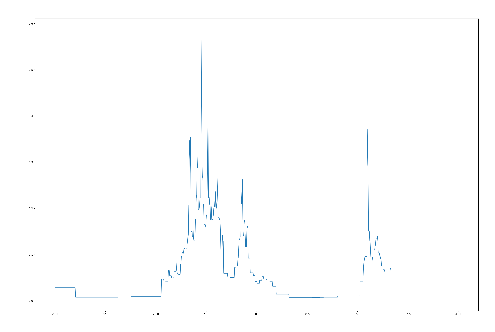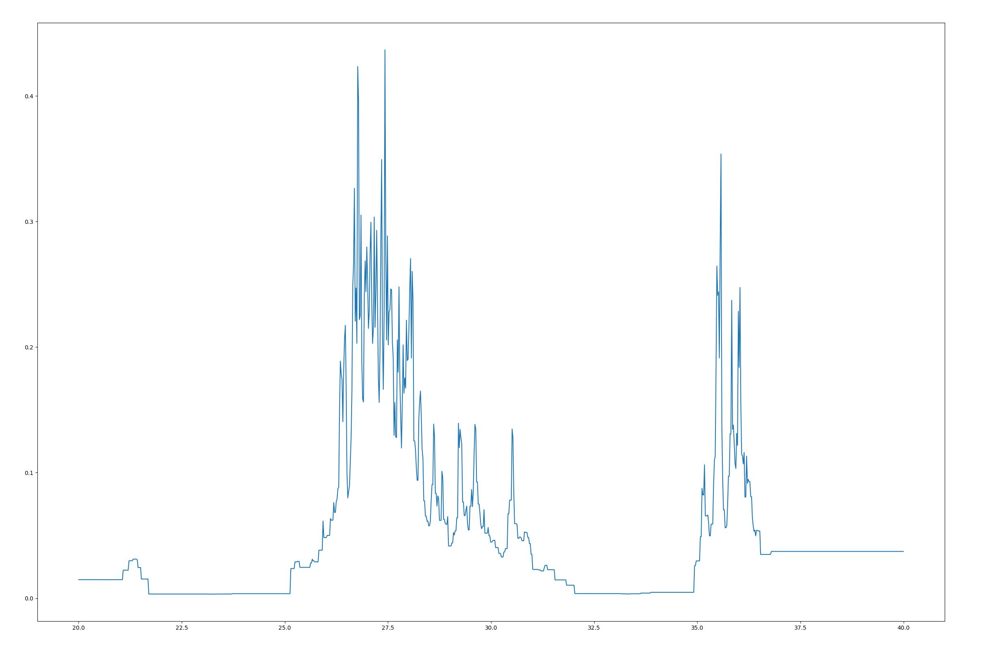</div>
<div align="center">
    Figure 14
</div>

We find that the number of spikes decreases as *K* increases. And one thing important is that there produce a high platform in the bigger side which is not the true distribution. On observations above, we prefer a smaller *K*, in order to prevent from losing too much information. 

<div align="center" >
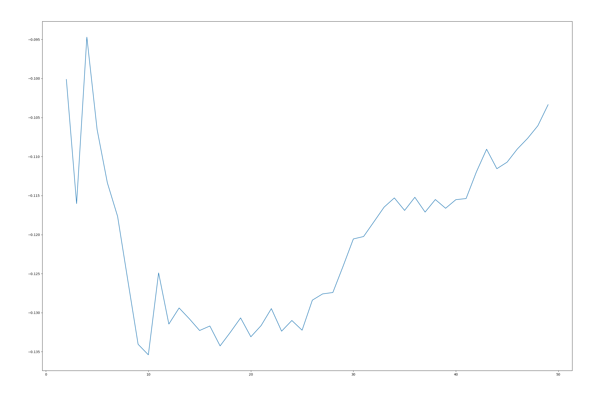
</div>

<div align="center">
    Figure 15
</div>

And as discussed in KDE, we could use some basic methods like minimizing the error. For convenience, we will still choose  *least-squares cross-validation* to get the best *K* here. According to the figure, 10 would be the best choice when consider a dataset with 500 data. And when we consider a larger dataset, such as 1000 data, we get another best *K*. So the best *K* grows as the growth of number of dataset. And unsurprisingly, the choice of *K* has a linear relationship with *N*, or say 2% of  *N*.

### Invalid Distribution

The conclusion of the invalidation would be easy to figure out theoretically. Consider *K* to be a large number, for example, the number of dataset, and $V_0$ is smallest space *S*, including all the data. Then for a test point in *S*, the *V* in the formular always asks for the $ V_0 $ in the test. That is $ V_0 $, *K* and *N* are all fixed. With *K=N*,  $p(x)=1/V_0$. So $\int_V p(x) dx=1$ in this situation, but there are space out of *S*, making $\int p(x) dx\neq 1$. So it's not always valid.

For another example, fix N=3 and K=2 in a 1D situation. And we named the three data from small to big as $ d_0,d_1,d_2 $. So test point between $d_0$ and $d_1$ has probability estimation as $\frac{2}{3×(d_1-d_0)}$. So $\int^{d_1}_{d_0}p(x)dx=\frac{2}{3×(d_1-d_0)}×(d_1-d_0)=\frac{2}{3}$. So $ \int^{d_2}_{d_0}p(x)dx=\frac{4}{3}>1 $. So it's invalid, too. 

In fact, the formular of k-NN isn't connected to the definition of probability, but closely connected to density. 

## Conclusions

In this paper, we simply discuss the parameters' influences over Histogram Method, KDE and k-NN on probability density estimation. We have discussed the influences caused by variance of the number of data, and choice of *bins*, *h*, *K* case by case. In general, as the database grows, the result is always better. But for other parameters, they have specific optimal according to *N*. They will have bad performances when they are too small or too big. And we have used *least-squares cross-validation* method to pick a nice parameter and confirmed our predictions in some way. Some other little considerations and works all have detailed discussions in the body of this paper. 

## Attachments

Attachments mainly include figures produced in the exploring process. Some of them have already presented in this paper. Please help yourself if you are interested in them. The name of each folder implies its aim, and I hope they are clear enough.

## References

Christopher M.Bishop, *Recognizing and Machine Learning*.

Jinmi Kim, Choongrak Kim, 2013, *Reducing the mean squared error in kernel density estimation*. Journal of the Korean Statistical Society, 387-397

Statistic 240 Lecture Notes: www.stat.berkeley.edu/∼stark/index.html